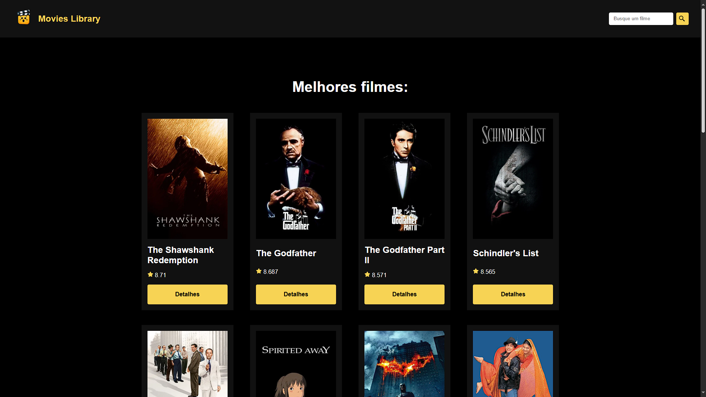
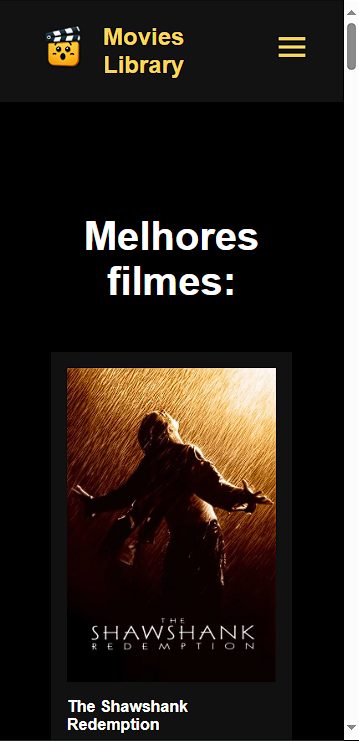

# 🎬 Movies Library

Movies Library é um aplicativo web que permite aos usuários visualizar informações sobre filmes, incluindo os mais bem avaliados, detalhes individuais e uma pesquisa interativa.

## 📸 Capturas de Tela

### 🖥️ Versão Desktop



### 📱 Versão Mobile



## [Vizualize o projeto clicando aqui](https://yudiyamada.github.io/projeto-filmes-api-tmdb/)

## 📌 Tecnologias Utilizadas
- **React** - Para construção da interface interativa
- **React Router** - Para navegação entre páginas
- **React Icons** - Para utilização de ícones estilizados
- **Vite** - Para um ambiente de desenvolvimento otimizado

## 🚀 Como Executar o Projeto
1. Clone este repositório:
   ```
   git clone https://github.com/YudiYamada/movies-library
   ```
2. Acesse a pasta do projeto:
   ```
   cd movies-library
   ```
3. Instale as dependências:
   ```
   npm install
   ```
4. Inicie o ambiente de desenvolvimento:
   ```
   npm run dev
   ```

## 🔍 Funcionalidades
- Exibição de filmes populares e bem avaliados
- Busca dinâmica de filmes
- Página de detalhes com informações completas sobre cada filme
- Navegação intuitiva entre páginas

## 📜 Licença
Este projeto está licenciado sob a MIT License.